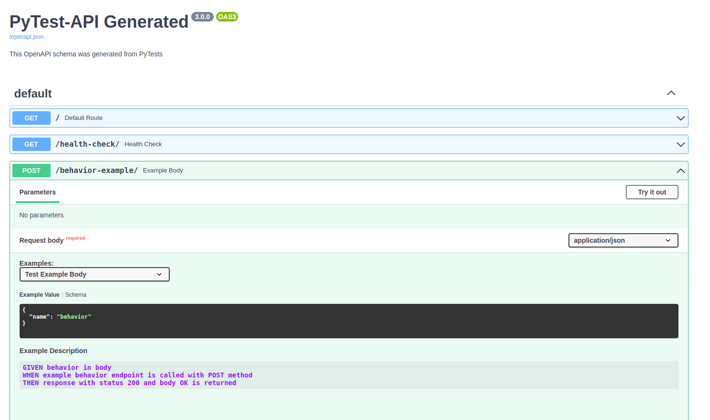

# PyTest-API: Populate OpenAPI Examples from Python Tests


PyTest-API is an [ASGI middleware](https://asgi.readthedocs.io/en/latest/specs/main.html#middleware) that populates [OpenAPI-Specification](https://github.com/OAI/OpenAPI-Specification/) examples from [pytest](https://pypi.org/project/pytest/) functions. 


## Installation

```
poetry add --dev pytest-api
```

## How to use it:

Starting with `test_main.py` file: 

```python
from .main import spec


@spec.describe(route="/behavior-example/")
def test_example_body(client):
    """
    GIVEN behavior in body
    WHEN example behavior endpoint is called with POST method
    THEN response with status 200 and body OK is returned
    """
    assert client.post(
        "/behavior-example/", json={"name": "behavior"},
        headers={"spec-example": test_example_body.id}
    ).json() == {"message": "OK"}
```

Impliment solution in `/main.py` file:

```python
from fastapi import FastAPI
from pydantic import BaseModel

from pytest_api import ASGIMiddleware

app = FastAPI()
spec = ASGIMiddleware

app.add_middleware(spec)

app.openapi = spec.openapi_behaviors(app)


class Behavior(BaseModel):
    name: str


@app.post("/behavior-example/")
async def example_body(behavior: Behavior):
    return {"message": "OK"}
```

Run FastAPI app:
```bash
poetry run uvicorn test_app.main:app --reload
```

Open your browser to http://localhost:8000/docs#/ too find the doc string is populated into the description.



## Implimentation Details

Under the hood the `ASGIMiddleware` uses the `describe` decorator to store the `pytest` function by its `id`: 

```python
def wrap_behavior(*args, **kwargs):
                try:
                    BEHAVIORS[route]
                except KeyError as e:
                    if route in e.args:
                        BEHAVIORS[route] = {str(id(func)): func}
                BEHAVIORS[route][str(id(func))] = func
```

When `pytest` calls your API the `SpecificationResponder` is looking for the coresponding `id` in the `headers` of the request:

```python
    def handle_spec(self, headers):
        behaviors = BEHAVIORS[self.path]
        self.should_update_example = headers.get("spec-example", "") in behaviors
        self.should_update_description = (
            headers.get("spec-description", "") in behaviors
        )

        if self.should_update_example:
            self.func = behaviors[headers.get("spec-example")]
        elif self.should_update_description:
            self.func = behaviors[headers.get("spec-description")]
```

This is possible thanks to python's first-class `functions` i.e. [Closure_(computer_programming)](https://en.wikipedia.org/wiki/Closure_(computer_programming)).

## Contributing

```python
poetry install
poetry run pytest
```
